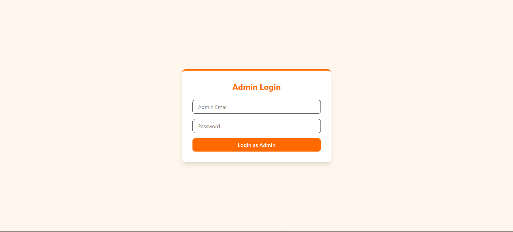
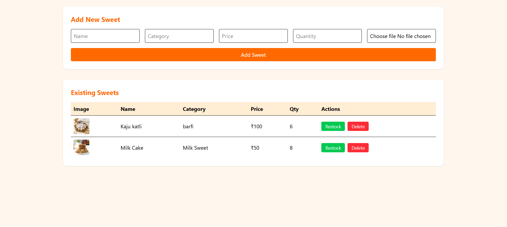
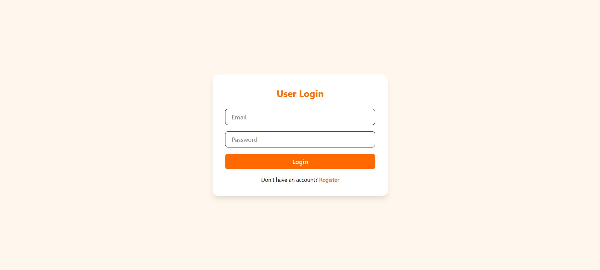
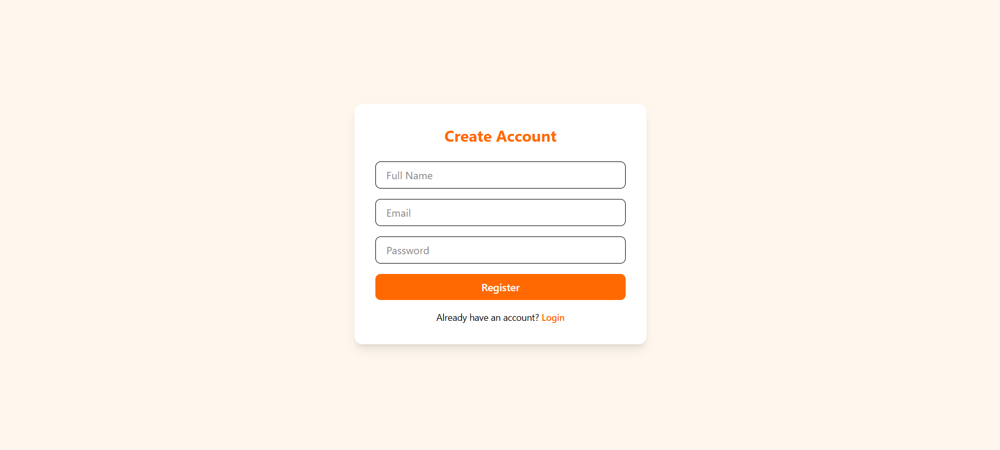
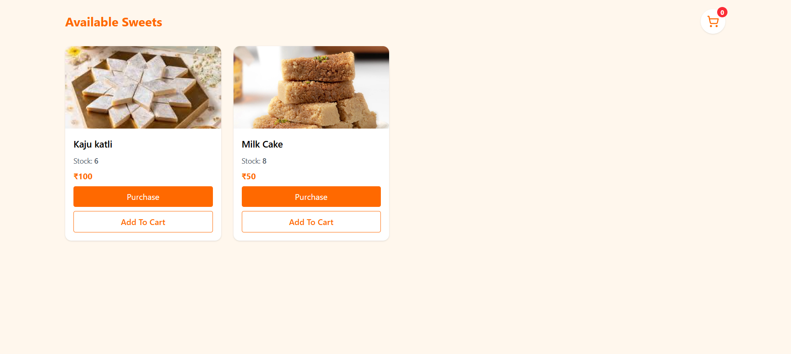
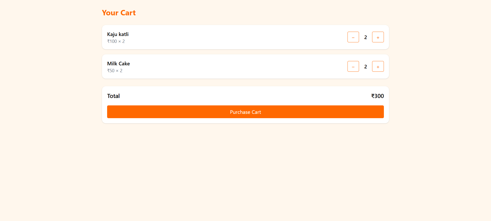

# 🍬 Sweet Shop Management System (MERN Stack)

A full-stack **Sweet Shop Management System** built using the **MERN stack**.  
The application allows customers to browse and purchase sweets, while administrators can manage inventory through a secure dashboard.

This project was developed as part of an academic / learning exercise to demonstrate backend API development, frontend integration, authentication, role-based access control, and cart functionality.

---

## 📌 Project Explanation

The Sweet Shop Management System consists of two major roles:

### 👤 Customer
- View available sweets with images, prices, and stock
- Add sweets to a cart (client-side using localStorage)
- Increase or decrease quantities with stock validation
- Purchase individual sweets or complete cart checkout

### 👨‍💼 Admin
- Secure admin login
- Add new sweets with image upload
- Update sweet details
- Restock sweets
- Delete sweets
- View and manage all sweets from a dashboard

The system uses **RESTful APIs**, **JWT authentication**, and **Cloudinary** for image storage.

---

## 🛠️ Tech Stack

### Frontend
- React (Vite)
- Tailwind CSS
- Axios
- React Router
- React Toastify

### Backend
- Node.js
- Express.js
- MongoDB (Mongoose)
- JWT Authentication
- Multer
- Cloudinary

### Deployment
- Frontend: Netlify / Vercel
- Backend: Render
- Database: MongoDB Atlas

---

## 🚀 Local Setup Instructions

### 📂 Prerequisites
- Node.js (v18 or higher)
- npm
- MongoDB Atlas account
- Cloudinary account

---

## 🔧 Backend Setup

git clone https://github.com/your-username/sweet-shop-mern.git
cd sweet-shop-mern/server
npm install
Create a .env file inside the server/ directory:

env
Copy code
PORT=5000
MONGO_URI=your_mongodb_connection_string
JWT_SECRET=your_jwt_secret

CLOUDINARY_CLOUD_NAME=your_cloudinary_name
CLOUDINARY_API_KEY=your_cloudinary_api_key
CLOUDINARY_API_SECRET=your_cloudinary_api_secret
Start the backend server:

bash
Copy code
npm run dev
Backend will be running at:

arduino
Copy code
http://localhost:5000
🎨 Frontend Setup
bash
Copy code
cd ../client
npm install
Create a .env file inside the client/ directory:

env
Copy code
VITE_SERVER_BASE_URI=http://localhost:5000
Start the frontend:

bash
Copy code
npm run dev
Frontend will be running at:

arduino
Copy code
http://localhost:5173
📸 Screenshots
All screenshots are stored in the screenshots/ folder at the project root.

<h3>Admin Login</h3>  <h3>Admin Dashboard</h3>  <h3>User Login</h3>  <h3>User Registration</h3>  <h3>Sweets Page</h3>  <h3>Cart Page</h3> 
🧪 Test Report
Testing Scope
The application was tested to validate:

User and admin authentication

Role-based route protection

Sweet CRUD operations

Cart quantity management

Stock validation

Purchase flows (single and cart-based)

Test Results
Feature	Test Case	Result
User Login	Valid credentials	Pass
Admin Login	Admin access	Pass
Add Sweet	Image + data upload	Pass
Update Sweet	Edit details	Pass
Restock Sweet	Quantity update	Pass
Delete Sweet	Remove sweet	Pass
Add to Cart	Quantity change	Pass
Cart Purchase	Stock validation	Pass
Route Protection	Unauthorized access blocked	Pass

No critical issues were identified during testing.

🤖 My AI Usage (Mandatory Section)
This project was developed with assistance from an AI tool (ChatGPT).

How AI Was Used
Generating initial boilerplate for backend controllers and frontend components

Assisting with debugging runtime and integration issues

Providing guidance on cart logic, authentication flow, and API design

Helping draft documentation and commit messages

Human Contribution
Implemented and refined all business logic

Integrated frontend and backend APIs

Designed UI using Tailwind CSS

Debugged issues and handled edge cases

Performed testing and validation

All final decisions and implementations were done manually.

